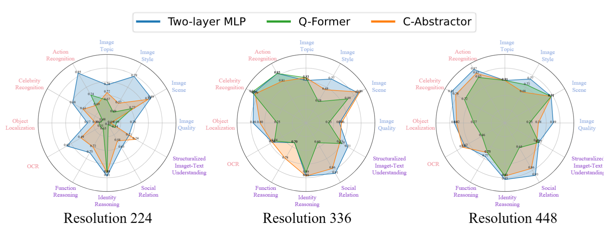

# To Preserve or To Compress: An In-Depth Study of Connector Selection in Multimodal Large Language Models

📰 [Paper](https://arxiv.org/abs/2410.06765)


<p align="center">
 
  
  <p align="center">Comparison of radar chart performance at 224, 336, and 448 resolutions across coarse-grained perception, fine-grained perception, and reasoning tasks on MMBench. Each task includes four sub-tasks: Image Quality, Image Scene, Image Style, and Image Topic for coarse-grained perception; Action Recognition, Celebrity Recognition, Object Localization, and OCR for fine-grained perception; and Function Reasoning, Identity Reasoning, Social Relation, and Structuralized Image-Text Understanding for reasoning tasks.</p>
</p>

## Evaluations

We use [LLaVA](https://github.com/haotian-liu/LLaVA) eval scripts and [`lmms-eval`](https://github.com/EvolvingLMMs-Lab/lmms-eval) to evaluate the benchmark performance for MLLMs. And collect the results then get fine-grained perception, coarse-grained perception and reasoning tasks scores respectively.


### Preliminary
We identified there are a little differences between llava scripts and `lmms-eval` in the evaluation process. Our evaluation process uses:

- **LLaVA Official Scripts**: For TextVQA, MMBench, MME, and VQAv2
- **LMMS-eval**: For SeedBench, RefCOCO, RefCOCO+, RefCOCOg, GQA, ScienceQA, POPE, and VizWiz VQA


### 1. Install the `lmms-eval` Environment

```Shell
cd <your_project_path>
git clone https://github.com/EvolvingLMMs-Lab/lmms-eval
cd lmms-eval
pip install -e .
```

And then modifiy your dataset_path in `lmms-eval/lmms_eval/tasks`

e.g.`dataset_path` in `lmms-eval/lmms_eval/tasks/pope/pope.yaml`. other benchmarks same as it.

```shell
./eval_pipeline.sh <your_model_path> <dataset_name>
# e.g.
./eval_pipeline.sh <your_model_path> mme
```


### 2.Evaluate Pipeline 
1. LLaVA official Evaluations scripts
For mme,mmbench,textvqa,vqav2 we follow the evaluate pipeline with `haotian-liu/LLaVA`.To do this here, we just simply merge scripts from `haotian-liu/LLaVA` for conveniency. 
Note: mmbench results need submit to official website to get the final reuslts
```shell
./eval_pipeline.sh <your_model_path> mme
```
2. lmms_eval
for SeedBench,Refcoco,Refcoco+,Refcocog,gqa,scienceqa,vizwiz_vqa, we follow the evaluate pipeline with `lmms-eval`

```shell
python3 -m accelerate.commands.launch \
    --num_processes=8 \
    -m lmms_eval \
    --model llava \
    --model_args pretrained="<your_model_path>" \
    --tasks seedbench,refcoco,refcoco+,refcocog,gqa,sicenceqa,vizwiz_vqa \
    --batch_size 1 \
    --log_samples \
    --log_samples_suffix llava_v1.5 \
    --output_path ./logs/
```

## Example
We focus on evaluating three tasks: coarse perception, fine-grained perception, and reasoning. These tasks are assessed through subtasks in MME, MMBench, and SeedBench benchmarks.

For MME benchmark,run the following command and then get the subtasks results of mme:
```shell
./eval_pipeline.sh <your_model_path> mme
```

For MMBench, run the following command and then get the subtasks results of mmbench:
```shell
./eval_pipeline.sh <your_model_path> mmbench
```
Your should notice that the mmbench results need to be submitted to the [official website](https://mmbench.opencompass.org.cn/mmbench-submission) to get the final results.


For SeedBench benchmark,run the following command and then get the subtasks results of seedbench:
```
python3 -m accelerate.commands.launch \
    --num_processes=8 \
    -m lmms_eval \
    --model llava \
    --model_args pretrained="<your_model_path>" \
    --tasks seedbench \
    --batch_size 1 \
    --log_samples \
    --log_samples_suffix llava_v1.5_mme \
    --output_path ./logs/
```
And then you can get the subtasks results of seedbench in the `./logs/` directory. And then run the following command to get the final results:
```shell
python3 seedbench_subtasks_analysis.py --json_path EVAL/eval_results/<to_your_results_file>
```
After obtaining the subtask results from MME, MMBench, and SeedBench, you can calculate the final results for coarse perception, fine-grained perception, and reasoning capabilities according to the reclassification protocol detailed in our paper.

For evaluating the remaining benchmarks (RefCOCO, RefCOCO+, RefCOCOg, GQA, ScienceQA, VizWiz), please follow the standard evaluation procedures using the LLaVA evaluation scripts and the `lmms-eval` toolkit.
All evaluation results will be stored in the following directory structure:

EVAL/eval_results/
├── mme/              # MME benchmark results
├── mmbench/          # MMBench benchmark results
└── seedbench/        # SeedBench benchmark results
